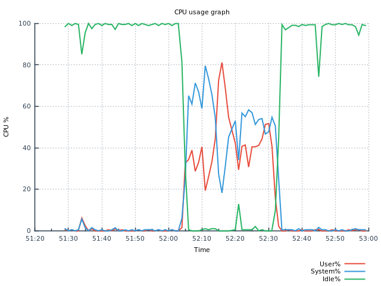
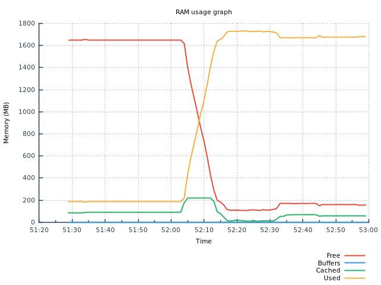
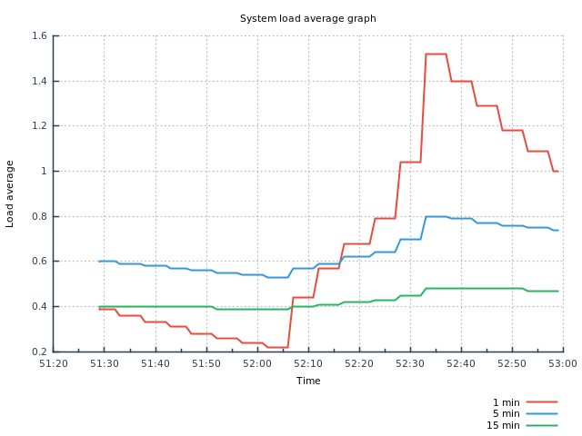
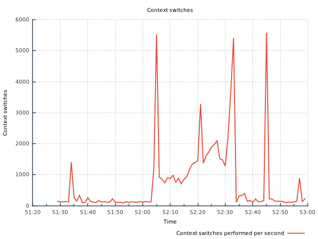
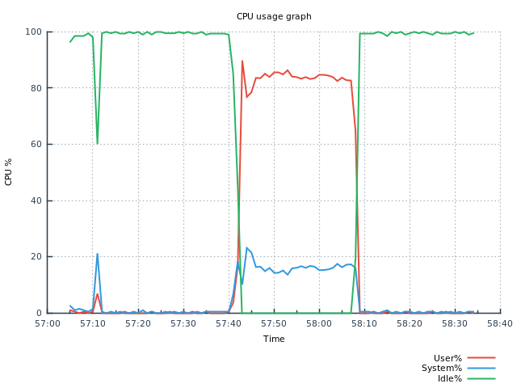
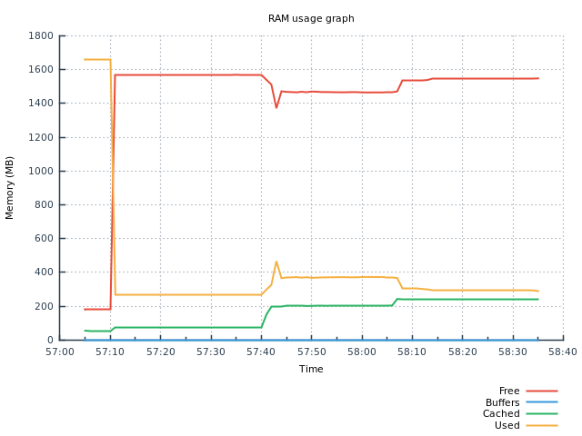
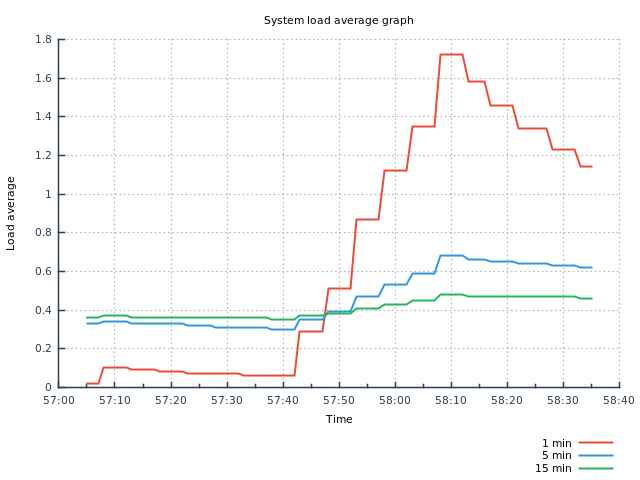
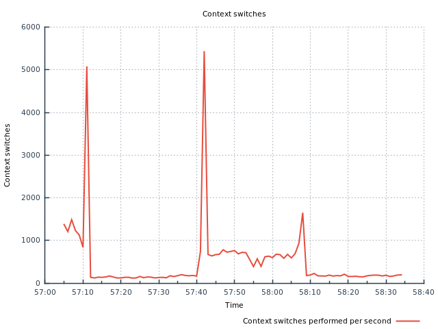

After posting [initial results](https://github.com/centminmod/centminmod-caddy-v2) on my laptop's Virtualbox setup, folks have asked what the server resource usage is like between Caddy v2 and Nginx. This can vary greatly due to how the respective web servers are built and configured settings wise. For example if Nginx is configured with caching and buffers, then their starting state memory usage would be higher but be more uniform during load at times.

I intended to move my testing over to a proper server to do resource monitoring measurements as a laptop Virtualbox environment isn't best. But I decided to do a quick test for h2load HTTP/3 tests between Caddy v2 and Centmin Mod Nginx 1.16.1 with Cloudflare Nginx HTTP/3 patch on the same setup done for tests [here](https://github.com/centminmod/centminmod-caddy-v2).

I had to change h2load test parameters as doing request based number tests would be too fast to completion for any accurate resource monitoring measurements. For example Nginx can complete 500 user concurrency with 2,000 requets for h2load HTTP/3 in 2.37 seconds. Hardly enough time to do any measurements. So changed h2load HTTP/3 tests to a duration of 20 seconds and small user concurrency for a quick test. I will reserve further testing with longer durations for when I have time to move the setup to a proper server for continued testing. The system resource usage statistics are at very bottom of the page.

h2load HTTP/3 HTTPS tests for 50 concurrent users and duration of 20 seconds with 5 second warm up time at 50 max concurrent streams

# HTTP/3 HTTPS Benchmark Results

| server | h2load HTTP/3 | requests/s | req time min | req time avg | req time max | cipher | protocol | successful req | failed req |
| ---| --- |--- |--- |--- |--- |--- |--- |---|---|
| caddy v2 | t1 c50 D20 m50 warmup 5s | 373.00 | 47.01ms | 7.22s | 12.91s | TLS_AES_128-GCM_SHA256  | h3-27 TLSv1.3 | 100% | 0% |
| nginx 1.16.1 patch | t1 c50 D20 m50 warmup 5s | 1446.55 | 534.93ms | 1.72s | 10.42s | TLS_AES_128-GCM_SHA256  | h3-27 TLSv1.3 | 100% | 0% |

# Caddy v2

```
caddyrestart; ngxstop; sleep 30; h2load-http3 -t1 -c50 -D 20 --warm-up-time=5 -m50 -H "Accept-Encoding:gzip" https://caddy.domain.com:4444/caddy-index.html
Redirecting to /bin/systemctl restart caddy.service
Stopping nginx (via systemctl):                            [  OK  ]
starting benchmark...
spawning thread #0: 50 total client(s). Timing-based test with 5s of warm-up time and 20s of main duration for measurements.
Warm-up started for thread #0.
progress: 10% of clients started
progress: 20% of clients started
progress: 30% of clients started
progress: 40% of clients started
progress: 50% of clients started
progress: 60% of clients started
progress: 70% of clients started
progress: 80% of clients started
progress: 90% of clients started
progress: 100% of clients started
TLS Protocol: TLSv1.3
Cipher: TLS_AES_128_GCM_SHA256
Server Temp Key: ECDH P-256 256 bits
Application protocol: h3-27
Warm-up phase is over for thread #0.
Main benchmark duration is started for thread #0.
Main benchmark duration is over for thread #0. Stopping all clients.
Stopped all clients for thread #0

finished in 25.86s, 373.00 req/s, 2.29MB/s
requests: 7460 total, 7460 started, 7460 done, 7460 succeeded, 0 failed, 0 errored, 0 timeout
status codes: 9015 2xx, 0 3xx, 0 4xx, 0 5xx
traffic: 45.80MB (48023049) total, 2.73MB (2858502) headers (space savings -11.82%), 43.23MB (45326876) data
                     min         max         mean         sd        +/- sd
time for request:    47.01ms      12.91s       7.22s       3.38s    55.87%
time for connect:        0us         0us         0us         0us     0.00%
time to 1st byte:        0us         0us         0us         0us     0.00%
req/s           :       0.00       10.63        7.23        1.48    80.00%
```

# Nginx 1.16.1

```
ngxrestart; caddystop; sleep 30; h2load-http3 -t1 -c50 -D 20 --warm-up-time=5 -m50 -H "Accept-Encoding:gzip" https://ngx.domain.com/caddy-index.html
Restarting nginx (via systemctl):                          [  OK  ]
Redirecting to /bin/systemctl stop caddy.service
starting benchmark...
spawning thread #0: 50 total client(s). Timing-based test with 5s of warm-up time and 20s of main duration for measurements.
Warm-up started for thread #0.
progress: 10% of clients started
progress: 20% of clients started
progress: 30% of clients started
progress: 40% of clients started
progress: 50% of clients started
progress: 60% of clients started
progress: 70% of clients started
progress: 80% of clients started
progress: 90% of clients started
progress: 100% of clients started
TLS Protocol: TLSv1.3
Cipher: TLS_AES_128_GCM_SHA256
Server Temp Key: X25519 253 bits
Application protocol: h3-27
Warm-up phase is over for thread #0.
Main benchmark duration is started for thread #0.
Main benchmark duration is over for thread #0. Stopping all clients.
Stopped all clients for thread #0

finished in 25.03s, 1446.55 req/s, 7.11MB/s
requests: 28931 total, 28931 started, 28931 done, 28931 succeeded, 0 failed, 0 errored, 0 timeout
status codes: 27904 2xx, 0 3xx, 0 4xx, 0 5xx
traffic: 142.19MB (149098871) total, 4.59MB (4817820) headers (space savings 55.13%), 167.34MB (175464789) data
                     min         max         mean         sd        +/- sd
time for request:   534.93ms      10.42s       1.72s       1.04s    83.99%
time for connect:        0us         0us         0us         0us     0.00%
time to 1st byte:        0us         0us         0us         0us     0.00%
req/s           :      12.79       45.22       29.52        8.17    60.00%
```

# Caddy v2 Resource Usage









# Nginx 1.16.1 Resource Usage










